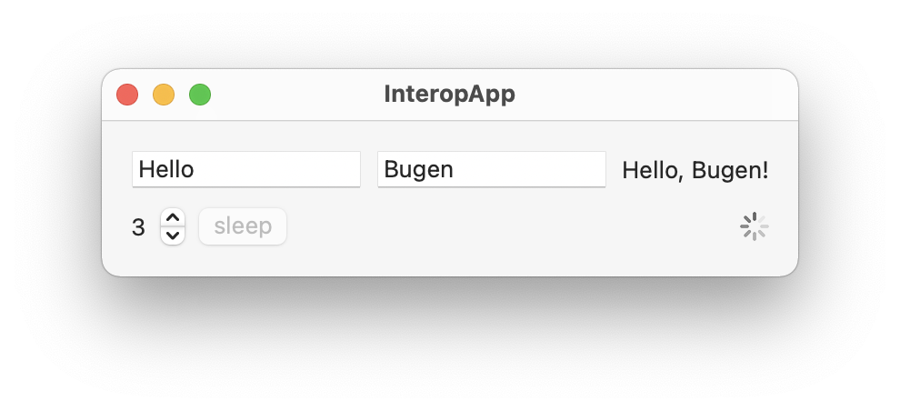
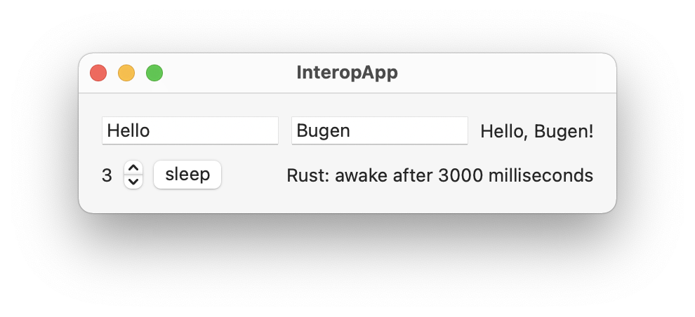

# rust-swift-pb-interop

A proof-of-concept for writing cross-platform logic in Rust and interoperating with platform-native language using Protobuf.

👇 `swift/.../ContentView.swift`

```swift
func sleep(seconds: Int, closure: @escaping (String) -> Void) {
    let sleepReq = SleepRequest.with {
        $0.millis = UInt64(seconds * 1000)
    }
    let req = Request.with {
        $0.sleep = sleepReq
    }
    rustCallAsync(req) { (res: SleepResponse) in
        closure(res.text)
    }
}
```

👇 `rust/src/async_handler.rs`

```rust
pub async fn handle_sleep(req: SleepRequest) -> Box<dyn Message> {
    tokio::time::sleep(tokio::time::Duration::from_millis(req.millis)).await;
    let res = SleepResponse {
        text: format!("awake after {} milliseconds", req.millis),
        ..Default::default()
    };
    Box::new(res)
}
```

👇 `protos/DataModel.proto`

```protobuf
message Request {
  oneof sync_req { ... }
  oneof async_req { SleepRequest sleep = 2; }
}
message SleepRequest { uint64 millis = 1; }
message SleepResponse { string text = 1; }

```

👇 Run the App

<p align="middle">
  
  
</p>

## Build

```bash
# prereqs
$ brew install swift-protobuf
$ cargo install cargo-lipo

# build
$ open swift/InteropApp/InteropApp.xcodeproj
# then press cmd+B, `build.sh` will be automatically triggered
```
